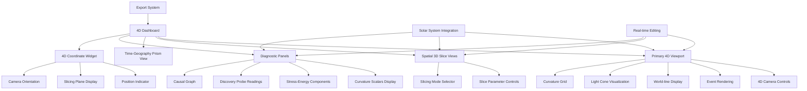

# 4D Dashboard Integration and Testing Plan

## Integration Steps

### 1. Enhance UI4D Class with Solar System Features
- Add solar system body visualization with proper scaling
- Implement orbital trajectory rendering in 4D
- Add planetary data panels showing mass, velocity, etc.
- Create solar system event markers with labels

### 2. Implement Real-time Editing Capabilities
- Add event creation/deletion tools in 4D space
- Implement world-line editing with proper time interpolation
- Add singularity manipulation controls (position, mass, spin, charge)
- Create body property editors (mass, radius, composition, etc.)

### 3. Integrate All Components into Cohesive 4D Dashboard
- Combine 4D viewport, slice views, causal graph, and discovery panel
- Implement view linking (selection in one view highlights in others)
- Add UI controls for toggling different visualization modes
- Create layout manager for resizable panels

### 4. Test and Validate Dashboard Functionality
- Test solar system visualization accuracy
- Validate 4D navigation controls responsiveness
- Check real-time editing effects on spacetime curvature
- Verify export functionality for spacetime models
- Performance testing with various solar system configurations

## Detailed Implementation Tasks

### UI4D Enhancement Tasks
1. Add solar system body rendering methods
2. Implement orbital trajectory calculation and display
3. Add planetary information panels
4. Create event labeling system for celestial bodies

### Real-time Editing Tasks
1. Implement 4D event creation tools (click-to-place)
2. Add world-line manipulation with control points
3. Create singularity property editors
4. Implement body property modification interface

### Integration Tasks
1. Create main dashboard layout manager
2. Implement view synchronization system
3. Add UI control panels for visualization options
4. Create export dialogs for spacetime data

### Testing Tasks
1. Develop test scenarios for solar system visualization
2. Create validation tests for 4D navigation accuracy
3. Implement performance benchmarks
4. Test export/import functionality

## Mermaid Diagram: Dashboard Architecture

## Timeline Estimation (Logical Order)
1. UI4D Enhancement (Solar System Features)
2. Real-time Editing Implementation
3. Component Integration
4. Testing and Validation

Each phase builds upon the previous one, ensuring a solid foundation for the interactive 4D dashboard.