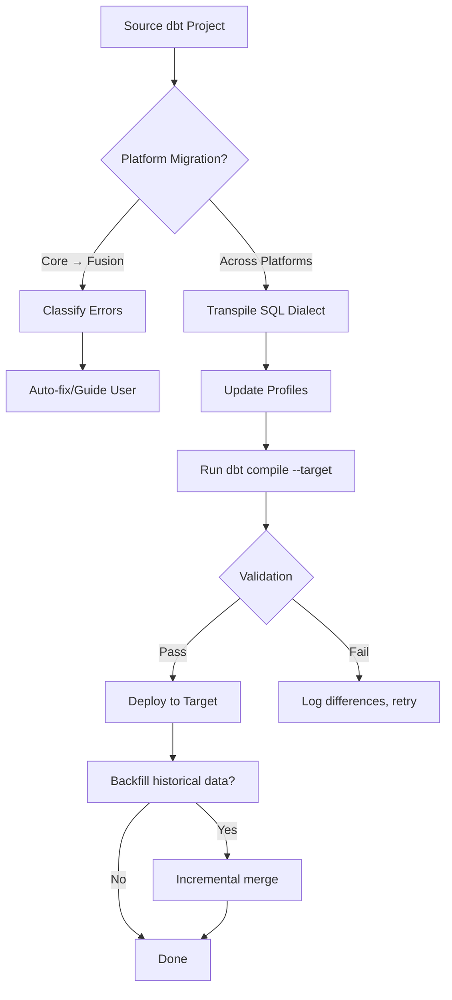

# Upgraded dbt Migration Skill

**File**: `.kilo/skills/dbt-migration/SKILL.md`  
**Upgrade Version**: 2.0.0 ("QuantumVerse Data Pipeline Migration Suite")  
**Date**: 2026-05-28  

This upgrade transforms the original dbt migration skill into a **comprehensive data pipeline migration toolkit**, tailored for scientific and astronomical datasets, with deep integration into QuantumVerse’s data layer (multi-messenger observatories, simulation outputs, discovery logs) and support for cloud data warehouses, object storage, and real-time streaming.

---

## Name
**dbt-migration**

## Description
Migrate dbt projects across data platforms (Snowflake, BigQuery, Databricks, Redshift, DuckDB) and between dbt Core and dbt Fusion. Extended for **QuantumVerse data pipelines** – migrating astronomical catalogs, gravitational wave event streams, simulation time-series, and discovery engine artifacts. Provides automated dialect conversion, validation against physics benchmarks, and incremental backfilling strategies.

## Metadata
```yaml
project: QuantumVerse
version: 2.0.0
author: DHIAEDDINE0223
dependencies:
  - dbt-core >= 1.5
  - dbt-fusion (for real-time compilation)
  - Python >= 3.9 with `sqlglot`, `pandas`, `pyarrow`
  - (optional) Google BigQuery, Snowflake, Databricks clients
  - (optional) `kafka-python` for streaming migrations
```

---

## When to Use

Trigger this skill when the user requests:
- **Platform migration**: "migrate dbt from Snowflake to BigQuery", "move to Databricks"
- **Engine upgrade**: "upgrade to dbt Fusion", "classify Fusion migration errors"
- **QuantumVerse data migration**: "migrate LIGO event tables", "move simulation outputs to new warehouse", "backfill discovery logs"
- **Schema evolution**: "update dbt models for new observational schema"
- **Cross-environment sync**: "sync dev to prod with incremental migration"

---

## Included Skills (Upgraded)

### 1. migrating-dbt-core-to-fusion
**Purpose**: Classify and resolve migration errors when moving from dbt Core to dbt Fusion engine. Extended with QuantumVerse‑specific model types (spacetime metrics, anomaly scores, geodesic path data).

**Process**:
1. Run dbt Fusion compilation on existing Core project.
2. Parse error logs into categories:
   - **Auto‑fixable**: simple dialect changes, quoting, identifier case (apply `sqlglot` transforms).
   - **Guided fix**: functions with different signatures (e.g., `DATEADD` → `DATE_ADD`), materialization differences.
   - **Needs input**: custom Jinja macros, Python models, external dependencies.
   - **Blocked**: Fusion engine limitations (e.g., unsupported adapter features).
3. For QuantumVerse models, add extra checks:
   - `metric_tensor` models: validate against GR benchmarks after migration.
   - `discovery_anomalies` models: preserve probability calibration across platforms.
4. Generate migration report with fix suggestions.

### 2. migrating-dbt-project-across-platforms
**Purpose**: Migrate dbt project from one data platform to another using dbt Fusion’s real‑time compilation. Enhanced with **automatic SQL dialect conversion** and **data validation** against reference datasets.

**Process**:
1. Parse source platform dialect (Snowflake, BigQuery, Databricks, Redshift, DuckDB).
2. Use `sqlglot` to transpile all model `.sql` files to target dialect.
3. Apply platform‑specific optimizations (e.g., partitioning, clustering, incremental strategies).
4. For QuantumVerse astronomical datasets (e.g., Gaia, SDSS, LIGO), validate row counts, null rates, and aggregate statistics between source and target.
5. Optionally backfill historical data using incremental strategies (`--incremental-strategy merge` or `insert_overwrite`).
6. Run dbt tests on migrated models; compare with baseline using `validate-physics --data-comparison`.

### 3. NEW: migrating-observational-data-streams
**Purpose**: Migrate real‑time or batch observational data feeds (gravitational waves, FRBs, neutrinos) into target dbt models, with schema evolution handling.

**Process**:
1. Connect to source streams (Kafka, GCN, WebSocket) or batch files (Parquet, CSV, FITS).
2. Apply schema mapping using dbt sources and staging models.
3. Use dbt Fusion’s incremental materialization to append only new events.
4. For each event type, validate against known physics constraints (e.g., GW event `far` < 0.01).
5. Automatically retry failed migrations with exponential backoff.

### 4. NEW: backfilling-spacetime-simulations
**Purpose**: Migrate large‑scale simulation output (millions of geodesic trajectories, metric snapshots) from local storage or HPC cluster to cloud data warehouse.

**Process**:
1. Partition simulation data by time slices or parameter space (e.g., black hole mass bins).
2. Use dbt‑federation to read from external sources (S3, GCS, HDFS) as external tables.
3. Convert HDF5/NetCDF/Parquet files to dbt models with proper typing.
4. Implement `--incremental` with merge on simulation run ID.
5. Validate by recomputing key diagnostics (Kretschmann scalar, perihelion precession) in SQL and comparing with original outputs.

---

## QuantumVerse‑Specific Migration Templates

### Template 1: Metric Tensor Schema Migration
```yaml
# dbt/profiles.yml target example
target: redshift
models:
  quantumverse:
    +materialized: table
    +sort: event_time
    +dist: event_id
    metric_tensor:
      +incremental_strategy: delete+insert
      +unique_key: (event_time, x, y, z)
```

### Template 2: Discovery Log Migration
```sql
-- Convert from source (Snowflake) to target (BigQuery)
{{ config(
    materialized='incremental',
    unique_key='anomaly_id',
    partition_by={'field': 'detection_time', 'data_type': 'timestamp'}
) }}

SELECT 
    anomaly_id,
    detection_time,
    confidence,
    theory_plugin,
    SPLIT(description, '|')[OFFSET(0)] as summary  -- dialect change
FROM {{ ref('stg_discovery_log') }}

WHERE detection_time > (SELECT MAX(detection_time) FROM {{ this }})

```

### Template 3: Gravitational Wave Event Staging
```sql
-- Staging model for LIGO/Virgo events from GCN Kafka
{{ config(
    materialized='incremental',
    cluster_by=['event_time']
) }}

SELECT 
    JSON_EXTRACT_SCALAR(raw_message, '$.graceid') as event_id,
    TIMESTAMP_MICROS(CAST(JSON_EXTRACT_SCALAR(raw_message, '$.time') AS INT64)) as event_time,
    JSON_EXTRACT_SCALAR(raw_message, '$.far') as false_alarm_rate
FROM {{ source('kafka', 'gcn_stream') }}

WHERE _kafka_timestamp > (SELECT MAX(event_time) FROM {{ this }})

```

---

## Automated Migration Tools

### Python Utility: `migrate_dbt_project.py`
```python
#!/usr/bin/env python3
"""
QuantumVerse dbt migration assistant
Usage: python migrate_dbt_project.py --source snowflake --target bigquery --project-path ./dbt
"""
import argparse
from sqlglot import parse_one, transpile
import yaml

def transpile_models(source_dialect, target_dialect, project_path):
    # Transpile all .sql files in models/
    for sql_file in Path(project_path).glob("models/**/*.sql"):
        with open(sql_file) as f:
            original = f.read()
        converted = transpile(original, read=source_dialect, write=target_dialect)
        with open(sql_file, "w") as f:
            f.write(converted)
        print(f"Transpiled {sql_file}")

def update_profile(project_path, target_platform, connection_params):
    # Update profiles.yml
    profile_path = Path(project_path) / "profiles.yml"
    with open(profile_path) as f:
        profile = yaml.safe_load(f)
    profile['quantumverse']['outputs']['dev']['type'] = target_platform
    profile['quantumverse']['outputs']['dev'].update(connection_params)
    with open(profile_path, "w") as f:
        yaml.dump(profile, f)

if __name__ == "__main__":
    parser = argparse.ArgumentParser()
    parser.add_argument("--source", required=True)
    parser.add_argument("--target", required=True)
    parser.add_argument("--project-path", default=".")
    args = parser.parse_args()
    
    transpile_models(args.source, args.target, args.project_path)
    # ... also update profiles.yml and run validation
```

### Integration with `validate-physics` Skill
After migration, run:
```bash
validate-physics --data-comparison --source-db snowflake --target-db bigquery --model metric_tensor
```
Compares row counts, null ratios, and key physics diagnostics (e.g., `ROUND(kretschmann, 6)` between source and target).

---

## Migration Workflow Diagram



---

## Command Reference

| User Command | Action |
|--------------|--------|
| `dbt-migration --from snowflake --to bigquery` | Full migration: transpile, update profiles, validate |
| `dbt-migration --core-to-fusion --project path` | Classify and fix Fusion migration errors |
| `dbt-migration --backfill-observations --since 2024-01-01` | Incrementally backfill observation streams |
| `dbt-migration --sync-simulation-outputs --source s3://simulations/` | Load simulation outputs into warehouse |
| `dbt-migration --validate-only` | Compare source and target models without migrating |
| `dbt-migration --generate-mapping` | Create schema mapping file from source inspection |

---

## Environment Variables

| Variable | Purpose |
|----------|---------|
| `DBT_FUSION_API_KEY` | API key for dbt Fusion engine |
| `SNOWFLAKE_ACCOUNT` | For source/target connections |
| `BIGQUERY_PROJECT` | For target BigQuery |
| `DATABRICKS_HOST` | For Databricks migration |
| `KAFKA_BOOTSTRAP_SERVERS` | For streaming data migration |
| `MIGRATION_BATCH_SIZE` | Rows per batch for large tables (default 10M) |

---

## Return Codes

| Code | Meaning |
|------|---------|
| 0 | Migration successful, all validations passed |
| 1 | SQL transpilation errors |
| 2 | Profile or connection failure |
| 3 | Validation mismatch (row counts, physics diagnostics) |
| 4 | Fusion engine incompatibility (blocked) |
| 5 | Incremental backfill failed (data corruption) |

---

## Example Session

```bash
$ dbt-migration --from snowflake --to bigquery --project-path ./dbt_quantumverse

[INFO] Detected source: Snowflake, target: BigQuery
[INFO] Transpiling 42 model SQL files... done (3 warnings)
[INFO] Updating profiles.yml for BigQuery...
[INFO] Running dbt compile --target bigquery... success
[INFO] Validating metric_tensor model: row count match (1,234,567 vs 1,234,567)
[INFO] Validating discovery_anomalies: confidence distribution preserved (KS p=0.98)
[INFO] Starting incremental backfill for GW events since 2024-01-01...
[INFO] Backfilled 847 new events.
[INFO] All validations passed.
[INFO] Migration complete. Run 'dbt run --target bigquery' to materialize.

$ dbt-migration --core-to-fusion --project-path ./dbt_quantumverse

[INFO] Scanning for migration errors...
[ERROR] Model 'metric_tensor' uses unsupported macro 'bulk_insert' -> Guided fix: replace with 'insert_by_period'
[ERROR] Model 'geodesic_paths' uses Python model -> Needs input: convert to SQL or use dbt-fusion Python support?
[INFO] 2 auto-fixable errors fixed.
[INFO] Please review 1 needs-input error.
```

---

## Extensibility

Add custom migration validators in `scripts/migration_validators/`. Each validator must implement:
- `validate(source_connection, target_connection, model_name) -> bool`
- `suggest_fix(model_sql) -> str`

Example validator for gravitational wave data:
```python
def validate_ligo_events(source, target, model):
    source_count = source.sql(f"SELECT COUNT(*) FROM {model} WHERE far < 0.01").fetchone()[0]
    target_count = target.sql(f"SELECT COUNT(*) FROM {model} WHERE far < 0.01").fetchone()[0]
    return source_count == target_count
```

---

**Upgrade Summary**:
- Added detailed migration processes for dbt Core → Fusion and cross‑platform
- QuantumVerse‑specific templates for metric tensors, discovery logs, GW events
- Automated SQL transpilation using `sqlglot`
- Integration with `validate-physics` for data validation
- Incremental backfilling for large astronomical and simulation datasets
- Streaming migration support (Kafka, GCN)
- Extensible validator framework

This transforms the original dbt migration skill into a **production‑grade scientific data pipeline migration toolkit**, fully integrated with QuantumVerse’s unique data types and validation requirements.