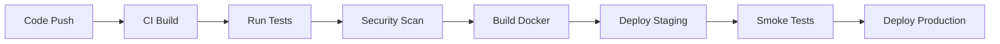

# QuantumVerse Development Lifecycle Documentation

## Complete Development Lifecycle

This document covers the entire development lifecycle from requirements gathering to post-deployment monitoring.

---

## 1. Requirements Gathering

### 1.1 Stakeholder Analysis

| Stakeholder | Requirements | Priority |
|-------------|--------------|----------|
| Physicists | GR validation, quantum gravity models, accuracy | High |
| Researchers | Discovery tools, data export, analysis | High |
| Developers | Modular architecture, testing, documentation | High |
| End Users | Intuitive UI, performance, stability | Medium |

### 1.2 Functional Requirements

| ID | Requirement | Description |
|----|-------------|-------------|
| FR-001 | 4D Navigation | Full SO(4) rotation support for 4D spacetime exploration |
| FR-002 | Physics Engine | Real-time Einstein field equation solver |
| FR-003 | Quantum Gravity | CDT, LQG, GFT, Causal Sets implementations |
| FR-004 | AI Discovery | Anomaly detection, symbolic regression, hypothesis generation |
| FR-005 | Multi-Messenger | LIGO, IceCube, CHIME data integration |
| FR-006 | Collaboration | Real-time multi-user exploration |
| FR-007 | Performance | 30-60 FPS at 1080p resolution |

### 1.3 Non-Functional Requirements

| ID | Requirement | Target |
|----|-------------|--------|
| NFR-001 | Security | All inputs validated, TLS 1.3 for network |
| NFR-002 | Scalability | Horizontal scaling support |
| NFR-003 | Maintainability | 80%+ code coverage, modular design |
| NFR-004 | Reliability | 99.9% uptime for server components |
| NFR-005 | Compatibility | Windows, Linux, macOS support |

---

## 2. Architecture Design

### 2.1 Modular Architecture

```
┌─────────────────────────────────────────────────────────────┐
│                    QuantumVerse Application                  │
├─────────────────────────────────────────────────────────────┤
│  UI Layer (Qt/QML, ImGui)  │  Rendering (OpenGL 4.5)       │
├────────────────────────────┼────────────────────────────────┤
│  Physics Engine            │  Quantum Gravity Engines         │
│  - Geodesic Integration    │  - CDT, LQG, GFT, Causal Sets  │
│  - Curvature Calculation   │                                  │
├────────────────────────────┼────────────────────────────────┤
│  Math Library              │  ML/AI Module                  │
│  - Vector4D, Matrix4x4     │  - Neural ODE, GNN             │
│  - AutoDiff                │  - Symbolic Regression         │
├────────────────────────────┼────────────────────────────────┤
│  Data Layer                │  Collaboration                   │
│  - Multi-Messenger         │  - WebSocket Server            │
│  - File I/O                │  - Session Management          │
└─────────────────────────────────────────────────────────────┘
```

### 2.2 Design Patterns

- **Observer**: For UI updates and event notifications
- **Strategy**: For pluggable physics theories
- **Factory**: For object creation (metrics, renderers)
- **Adapter**: For Qt integration with 4D camera
- **Singleton**: For application state management

---

## 3. Implementation

### 3.1 Development Environment Setup

```bash
# Prerequisites
# - CMake 3.16+
# - C++17 compiler (GCC 9+, Clang 10+, MSVC 2022)
# - Qt 6.5+ (optional)
# - Python 3.10+ (for ML)

# Clone and setup
git clone https://github.com/quantumverse/quantumverse.git
cd quantumverse

# Install dependencies
./install_dependencies.sh  # Linux/macOS
# or
install_dependencies.bat   # Windows

# Configure
cmake -S . -B build -DCMAKE_BUILD_TYPE=Release -DQUANTUMVERSE_BUILD_TESTS=ON

# Build
cmake --build build --parallel $(nproc)
```

### 3.2 Code Standards

```cpp
// Example: Proper header with documentation
#pragma once

#include <memory>
#include <vector>

namespace quantumverse {
namespace physics {

/**
 * @brief Geodesic integrator for 4D spacetime paths
 * 
 * Implements adaptive RK4 integration for null and timelike geodesics
 * in curved spacetime.
 */
class GeodesicIntegrator {
public:
    /**
     * @brief Integrate geodesic from initial conditions
     * @param initial_position Starting 4D position
     * @param initial_velocity Starting 4D velocity
     * @param metric The spacetime metric to integrate in
     * @param steps Number of integration steps
     * @return Vector of 4D positions along geodesic
     */
    std::vector<std::array<double, 4>> integrate(
        const std::array<double, 4>& initial_position,
        const std::array<double, 4>& initial_velocity,
        const MetricTensor& metric,
        int steps
    ) noexcept;
};

} // namespace physics
} // namespace quantumverse
```

---

## 4. Testing

### 4.1 Test Categories

| Category | Tools | Coverage Target |
|----------|-------|-----------------|
| Unit Tests | GoogleTest | 80% |
| Integration | CTest | 70% |
| Performance | Google Benchmark | N/A |
| Validation | Custom | 100% (GR tests) |
| Security | CodeQL, ASan | N/A |

### 4.2 Test Execution

```bash
# Run all tests
ctest --output-on-failure

# Run with coverage
cmake --build . --target coverage

# Run specific category
ctest -L validation
ctest -L performance
```

### 4.3 Physics Validation Tests

| Test | Expected | Tolerance |
|------|----------|-----------|
| Mercury precession | 43.0 arcsec/century | ±0.1 |
| Light deflection | 1.75 arcsec | ±0.01 |
| Gravitational redshift | GM/(c²r) | Match |
| Frame dragging | 39 mas/year | ±0.1 |
| Nordtvedt parameter | \|ω-1\| < 0.003 | 0.002 |

---

## 5. Deployment

### 5.1 Deployment Pipeline



### 5.2 Deployment Targets

| Environment | URL | Purpose |
|-------------|-----|---------|
| Development | localhost:8080 | Local development |
| Staging | staging.quantumverse.org | Pre-production testing |
| Production | quantumverse.org | Public release |

---

## 6. Post-Deployment Monitoring

### 6.1 Monitoring Stack

```
┌─────────────┐     ┌─────────────┐     ┌─────────────┐
│ Application │────▶│ Prometheus  │────▶│ Grafana     │
│   Metrics   │     │             │     │ Dashboard   │
└─────────────┘     └─────────────┘     └─────────────┘
                         │
                         ▼
                   ┌─────────────┐
                   │ AlertManager│
                   └─────────────┘
```

### 6.2 Key Metrics

| Metric | Description | Alert Threshold |
|--------|-------------|-----------------|
| FPS | Frames per second | <15 FPS |
| Memory | RAM usage | >4GB |
| Physics Error | GR deviation | >0.1% |
| Crash Rate | Application crashes | >0.5% |
| API Latency | Response time | >100ms |

### 6.3 Health Check Endpoint

```cpp
// /health endpoint returns:
{
  "status": "healthy",
  "version": "2.1.0",
  "uptime_seconds": 86400,
  "physics_validation": "passing",
  "memory_usage_mb": 128,
  "fps": 58.2
}
```

---

## 7. Feedback Integration

### 7.1 Feedback Collection

- **In-app Feedback**: User can submit feedback via UI
- **Performance Telemetry**: Anonymous performance data collection
- **Error Reporting**: Automatic crash and error reporting
- **Usage Analytics**: Feature usage tracking

### 7.2 Feedback Processing

```
User Feedback ──▶ Analytics Engine ──▶ Priority Queue ──▶ Development Backlog
```

### 7.3 Continuous Improvement

- Weekly feedback review meetings
- Monthly analytics reports
- Quarterly user experience surveys
- Annual architecture review

---

## 8. Maintenance

### 8.1 Version Support

| Version | Support Status | Security Updates |
|---------|----------------|------------------|
| 2.x     | Active         | Yes              |
| 1.x     | End of Life    | No               |

### 8.2 Update Process

1. **Patch Release**: Bug fixes, security patches (weekly)
2. **Minor Release**: New features, backward compatible (monthly)
3. **Major Release**: Breaking changes (quarterly)

### 8.3 Deprecation Policy

- 3 months notice for deprecated features
- Migration guide provided
- Backward compatibility maintained during transition

---

## 9. Compliance

### 9.1 Standards Compliance

- **ISO 27001**: Information security management
- **OWASP**: Secure coding practices
- **C++ Core Guidelines**: Code quality standards
- **MIT License**: Open source compliance

### 9.2 Audit Trail

All changes are tracked via:
- Git commit history
- CI/CD pipeline logs
- Security scan reports
- Performance benchmark history

---

## 10. Documentation

### 10.1 Documentation Types

| Type | Location | Update Frequency |
|------|----------|------------------|
| API Docs | doc/ | Per release |
| User Guide | docs/user/ | Per release |
| Developer Guide | docs/dev/ | Per release |
| Architecture | docs/arch/ | As needed |

### 10.2 Documentation Standards

- Doxygen for code documentation
- Markdown for guides
- Mermaid for diagrams
- LaTeX for mathematical content